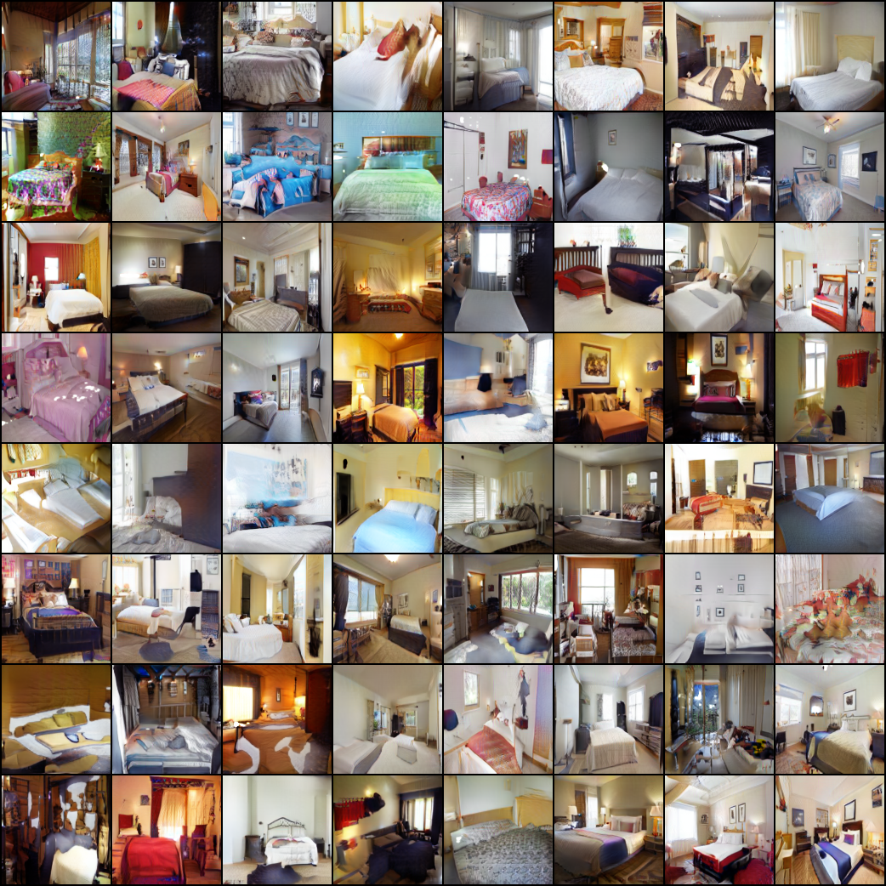

# DeshuffleGAN

Official PyTorch implementation of DeshuffleGANs:

[Deshufflegan: A Self-Supervised Gan to Improve Structure Learning](https://ieeexplore.ieee.org/document/9190774)

[Exploring DeshuffleGANs in Self-Supervised Generative Adversarial Networks](https://arxiv.org/abs/2011.01730)


## Prerequisites
- Python 3.7
- PyTorch >= 1.4.0
- Torchvision >= 0.5.0
- CUDA >= 10.1

## Getting Started
### 1. Prepare datasets
- [LSUN Bedroom & Church](https://github.com/fyu/lsun)

- [CelebA-HQ](https://github.com/tkarras/progressive_growing_of_gans#preparing-datasets-for-training)

### 2. Modify _param.py_ according to your training settings
### 3. Run 
```bash
python train_deshufflegan.py
```
## Evaluation Results


## Generation Results

### LSUN-Bedroom


### LSUN-Church


### ImageNet


## Comparison (Deshuffle vs Rotation)


## Citation
If you use this code for your research, please cite our papers.
```
@INPROCEEDINGS{9190774,  
  author={Baykal, Gulcin and Unal, Gozde},  
  booktitle={2020 IEEE International Conference on Image Processing (ICIP)},   
  title={Deshufflegan: A Self-Supervised Gan to Improve Structure Learning},   
  year={2020},  
  volume={},  
  number={},  
  pages={708-712},  
  doi={10.1109/ICIP40778.2020.9190774}
}

@misc{baykal2020exploring,
      title={Exploring DeshuffleGANs in Self-Supervised Generative Adversarial Networks}, 
      author={Gulcin Baykal and Furkan Ozcelik and Gozde Unal},
      year={2020},
      eprint={2011.01730},
      archivePrefix={arXiv},
      primaryClass={cs.CV}
}
```
